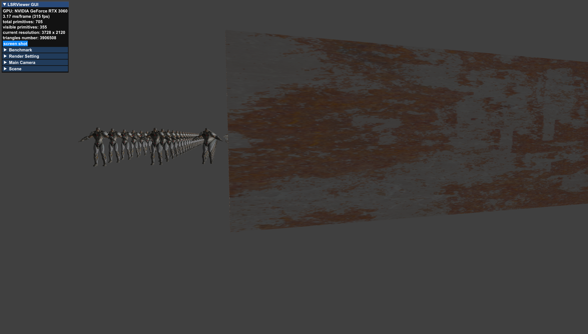

# LSRViewer
Large  Scene Rendering Viewer

## Platform

* Windows 10 Professional
* CPU: Intel(R) Core(TM) i9-10900 CPU @ 2.80GHz

* GPU: NVIDIA GeForce RTX 3060

## Dev Environment

* Visual Studio Community 2019
* CMake 3.20.0
* Python 3.9.2
* Vulkan 1.0

## Third Party Dependency

* [Vulkan](https://github.com/SaschaWillems/Vulkan)
* [CTPL](https://github.com/vit-vit/CTPL)
* [entt](https://github.com/skypjack/entt)
* [astc-encoder](https://github.com/ARM-software/astc-encoder)
* [glslang](https://github.com/KhronosGroup/glslang)
* [spirv-cross](https://github.com/KhronosGroup/SPIRV-Cross)
* [stb](https://github.com/nothings/stb)
* [tinygltf](https://github.com/syoyo/tinygltf/)

## Build

1. Windows 10 OS
2. Install Visual Studio Community 2019, CMake 3.20.0 and Vulkan
3. Run `build.bat` 

## Feature

### Basic Render Pipeline

### GPU Frustum Culling

### GPU Occlusion Culling

### Bindless Texture

### Tessellation

